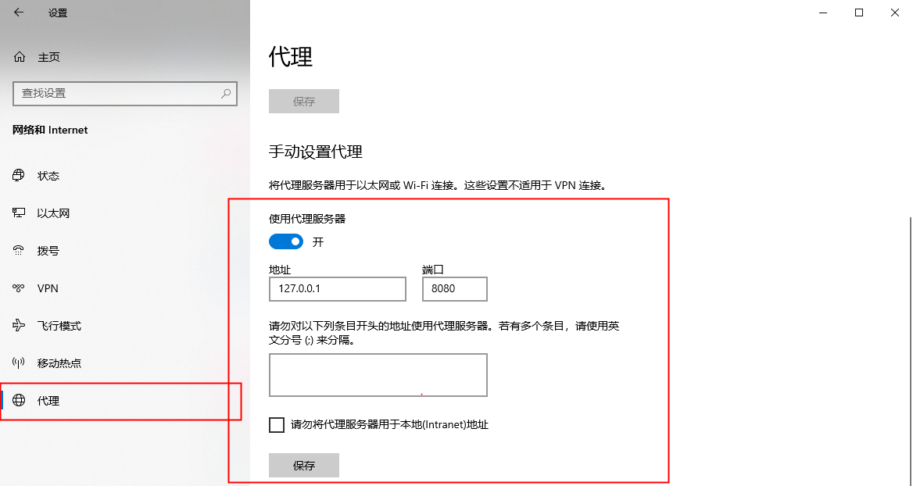
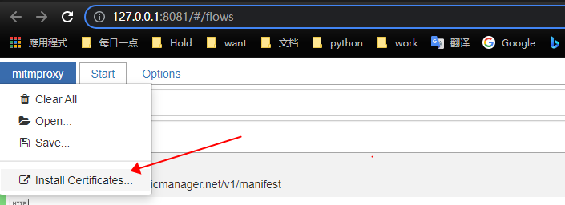
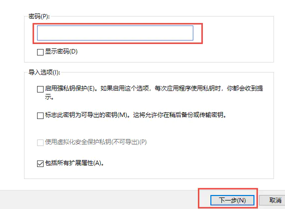

## 信息  
中间人代理, 用于在请求过程中, 对请求或响应进行一些修改  
* 拦截HTTP和HTTPS请求和响应  
* 保存HTTP会话并进行分析  
* 模拟客户端发起请求，模拟服务端返回响应  
* 利用反向代理将流量转发给指定的服务器  
* 支持Mac和Linux上的透明代理  
* 利用Python对HTTP请求和响应进行实时处理  

官网: https://mitmproxy.org/  

## 安装  

访问官网下载安装包, 安装完毕后将 **安装目录/bin** 添加到环境变量中, 即可使用 **mitmproxy**, **mitmweb**, **mitmdump**  

测试是否安装成功  
~~~
mitmdump
~~~

## 安装证书  

启动 mitmweb  
~~~bash
mitmweb
~~~
`Web server listening at http://127.0.0.1:8081/`  
`Proxy server listening at http://*:8080`  

此时 mitmweb 会监听 8080 端口  

在系统中设置代理走  mitmweb 监听的端口  
    
删除白名单中的内容，以免出错  

浏览器中打开 http://127.0.0.1:8081/ , 选择安装证书, 点击对应平台  
  

安装证书  

1. 不使用私钥密码  
	  

2. 证书导入选择 受信任的根证书颁发机构  
	  

