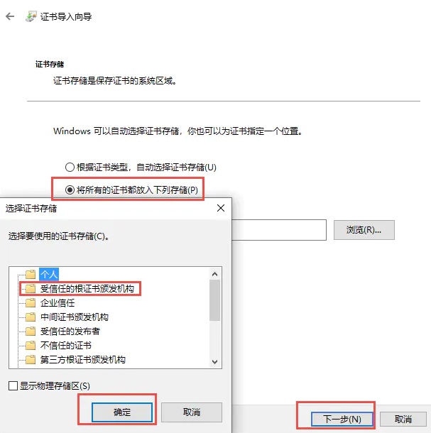

## 信息  
中间人代理, 用于在请求过程中, 对请求或响应进行一些修改  
* 拦截HTTP和HTTPS请求和响应  
* 保存HTTP会话并进行分析  
* 模拟客户端发起请求，模拟服务端返回响应  
* 利用反向代理将流量转发给指定的服务器  
* 支持Mac和Linux上的透明代理  
* 利用Python对HTTP请求和响应进行实时处理  

官网: https://mitmproxy.org/  

## 安装  

访问官网下载安装包, 安装完毕后将 **安装目录/bin** 添加到环境变量中, 即可使用 **mitmproxy**, **mitmweb**, **mitmdump**  

测试是否安装成功  
~~~
mitmdump
~~~

### 安装证书  

不安装证书则无法解析 HTTPS, 大部分网站都使用的 HTTPS, 所以几乎不能不装  
浏览器的证书和系统的证书时分开管理的, 希望哪一个使用代理就让哪一个装上证书    

#### 浏览器安装证书  

1. 启动 mitmweb  
	~~~bash
	mitmweb
	~~~
	`Web server listening at http://127.0.0.1:8081/`  
	`Proxy server listening at http://*:8080`  

	此时 mitmweb 会监听 8080 端口  

2. 系统中设置代理走 mitmweb 监听的端口  
    
删除白名单中的内容，以免出错  

3. 浏览器中打开 http://127.0.0.1:8081/ , 选择安装证书, 点击对应平台  
  

4. 安装证书  

   1. 不使用密码  
   	  

   2. 证书导入选择 受信任的根证书颁发机构  
   	  

#### 系统安装证书  

windows找到其证书文件双击即可, 其安装过程同上  
Linux  

1. 获取证书  
	首先运行一下命令产生 CA 证书，启动 MitmDump 即可
	~~~
	mitmdump
	~~~
 	目录会下生成 **.mitmproxy** 目录, 在其中能够找到 CA证书  

2. 转换文件  
	如果遇到的是 **.pem** 的文件，必须先将其转换为 **.crt** 文件  
	~~~
 	openssl x509 -in mitmproxy-ca-cert.pem -inform PEM -out mitmproxy-ca-cert.crt
	~~~

3. 创建自己的 CA证书 存放目录  
	可以在以下位置为额外的CA证书创建目录/usr/share/ca-certificates  
	~~~bash
	sudo mkdir /usr/share/ca-certificates/extra
	~~~

4. 将 **.crt** 文件复制到此目录  
	~~~bash
	sudo cp mitmproxy-ca-cert.crt /usr/share/ca-certificates/extra/mitmproxy-ca-cert.crt
	~~~

5. 证书路径载入  
	~~~bash
	sudo dpkg-reconfigure ca-certificates
	~~~
 	会遇到一个安装界面，直接回车就可以了，安装完成  
