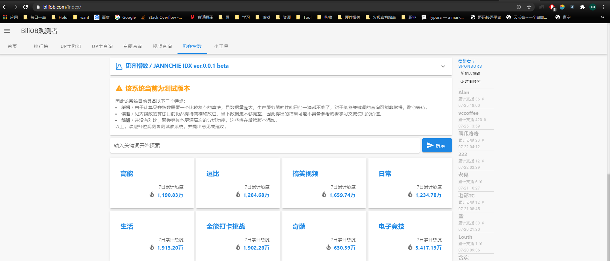
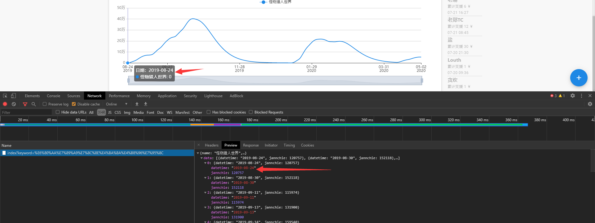
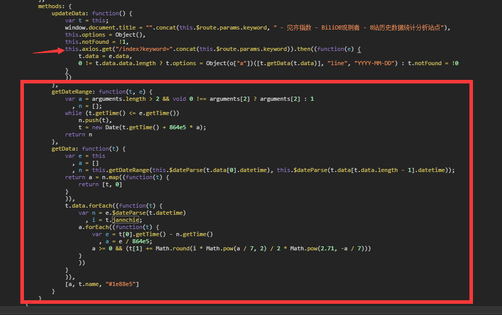

## 基本信息  
目标URL：https://www.biliob.com/index  
<!--    -->
  

## 描述  
分析完毕以后发现是动态网页，js没有混淆有逻辑加密  

## 使用的包/工具/技术  
|步骤|包/工具/技术|
|--|--|
|网页分析|Devtools|
|爬取网页|requests|
|解析网页|json|

## 问题与对应处理  
### IP访问频率  
懒得弄代理，选择每次爬取后等待一段时间  
### User-Agent限制  
请求头填写自己编写`User-Agent`即可  
### 模拟Ajax请求  
请求头填写自己编写`X-Requested-With`即可  
### 加密/压缩 的数据
根据参数线索，在js中寻找解密/解压逻辑  
利用python构建一个和js里一样的逻辑即可解密/解压  

## 分析  

### 查看网页源码  
<!--    -->
  
网页本身并没有任何的有用信息，是一个动态页面  
不知道用户的搜索目标是啥，给个干净的页面很正常  

### 寻找Ajax目标数据包  
<!--    -->
  
发现只有一个数据包  

url: https://www.biliob.com/api/index  
* keyword  
搜索关键词，明文  

### 观察目标数据包  
<!--    -->
  
观察到数据包的数据项稀疏只有部分天数的数据，而网页中的数据完整每一天都有指数  
判断存在加密/压缩的情况  

### 被加密/压缩的数据  
根据响应json的关键词`jannchie`进行全局搜索  
<!--    -->
  
找到四个结果，一一查看，最终在最后一个js中找到`Axios`的`Ajax`信息  

<!--    -->
  
下面有响应的js解析逻辑，然后用python构建一模一样的逻辑，将数据解开  

~~~python
def _decryption_data(data: dict):
    '''
    根据js构建的数据解密计算
    '''
    # json里的值并非所求，需要解密
    # data = [{'datetime': '2019-07-18', 'jannchie': 104989}, {'datetime': '2019-07-25', 'jannchie': 108426}, {'datetime': '2019-08-24', 'jannchie': 120663}, {'datetime': '2019-08-30', 'jannchie': 140592}, {'datetime': '2019-09-11', 'jannchie': 115432}, {'datetime': '2019-09-13', 'jannchie': 131578}, {'datetime': '2019-09-14', 'jannchie': 159540}, {'datetime': '2019-09-20', 'jannchie': 130836}, {'datetime': '2019-09-21', 'jannchie': 109326}, {'datetime': '2019-09-21', 'jannchie': 108434}, {'datetime': '2019-09-26', 'jannchie': 119078}, {'datetime': '2019-10-01', 'jannchie': 101894}, {'datetime': '2019-10-03', 'jannchie': 245706}, {'datetime': '2019-10-03', 'jannchie': 167092}, {'datetime': '2019-10-07', 'jannchie': 114827}, {'datetime': '2019-10-09', 'jannchie': 171679}, {'datetime': '2019-10-10', 'jannchie': 148091}, {'datetime': '2019-10-10', 'jannchie': 101217}, {'datetime': '2019-10-12', 'jannchie': 111358}, {'datetime': '2019-10-19', 'jannchie': 109068}, {'datetime': '2019-10-21', 'jannchie': 106133}, {'datetime': '2020-01-12', 'jannchie': 192665}, {'datetime': '2020-01-18', 'jannchie': 425013}, {'datetime': '2020-01-26', 'jannchie': 125028}, {'datetime': '2020-01-26', 'jannchie': 105658}, {'datetime': '2020-02-03', 'jannchie': 120042}, {'datetime': '2020-02-11', 'jannchie': 110348}, {'datetime': '2020-02-12', 'jannchie': 126597}, {'datetime': '2020-02-17', 'jannchie': 148542}, {'datetime': '2020-04-11', 'jannchie': 108354}]

    first_day = datetime.strptime(data[0]['datetime'], r'%Y-%m-%d')
    last_day = datetime.strptime(data[-1]['datetime'], r'%Y-%m-%d')
    n = []
    for day_num in range((last_day-first_day).days + 1):
        n.append([first_day + timedelta(days=day_num), 0])

    for note in data:
        _jannchie = note["jannchie"]
        _compara_day = datetime.strptime(note['datetime'], r'%Y-%m-%d')
        for note in n:
            e = note[0] - _compara_day
            a = e.days
            if a >= 0:
                note[1] = note[1] + round(_jannchie * math.pow(a/7, 2) / 2 * math.pow(2.71, -a/7))
    data = {}
    for note in n:
        data[note[0].strftime(r'%Y-%m-%d')] = note[1]
    return data
~~~

Recluse 2020-7-23 23:12:00 
