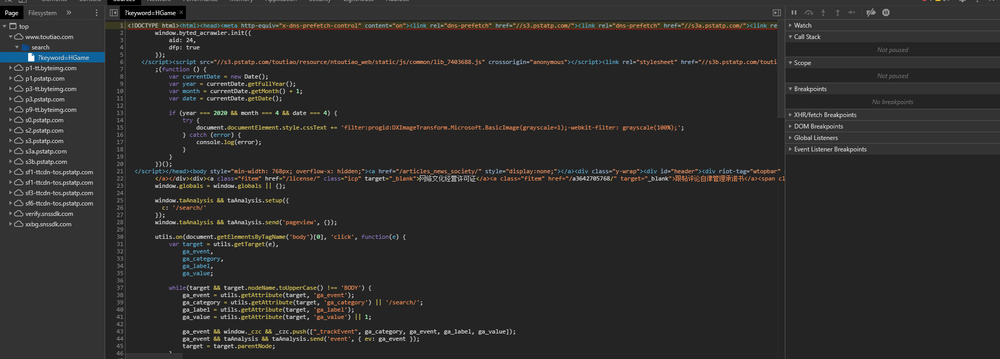

## 基本信息  
目标URL：https://www.toutiao.com/search/?keyword=Python  
<!--    -->
  

## 描述  
分析完毕以后发现是动态网页，js没有混淆没有逻辑加密  

## 使用的包/工具/技术  
|步骤|包/工具/技术|
|--|--|
|网页分析|Devtools、Postman|
|爬取网页|requests|
|解析网页|json|

## 问题与对应处理  
### IP访问频率  
懒得弄代理，选择每次爬取后等待一段时间  
### User-Agent限制  
请求头填写自己编写`User-Agent`即可  
### 模拟Ajax请求  
请求头填写自己编写`X-Requested-With`即可  

## 分析  

### 查看网页源码  
<!--    -->
  
网页本身并没有任何的有用信息，是一个动态页面  
不知道用户的搜索目标是啥，给个干净的页面很正常  

### 寻找Ajax目标数据包  
<!--    -->
  
发现有三个数据包  
其中，只有第一个有正常数据，其它的都只有非常简单的数据  

### 观察目标数据包  
<!--    -->
  
url: https://www.toutiao.com/api/search/content/

|请求参数|值|信息|
|--|--|--|
|aid|24|未知作用 各搜索结果值均固定不变|
|app_name|web_search|猜测为调用数据方式 各搜索结果值均固定不变|
|offset|0|偏移量 每一次增加20，相当于翻页|
|format|json|猜测为响应格式|
|keyword|HGame|搜索的关键词|
|autoload|true|未知作用 各搜索结果值均固定不变|
|count|20|未知作用 各搜索结果值均固定不变|
|en_qc|1|未知作用 各搜索结果值均固定不变|
|cur_tab|1|未知作用 各搜索结果值均固定不变|
|from|search_tab|未知作用 各搜索结果值均固定不变|
|pd|synthesis|未知作用 各搜索结果值均固定不变|
|timestamp|1595779203605|时间戳 不填入参数依然正确响应|
|_signature|-r7iXgAgEBBqQWD19SI JM.q.o0AAKWte94PGD6x Y9xhWRMACFi3i1UdDa-Q 6heiCUpOfXpqzvp51-8a WA26.zye-sEMkYWErNAN tSm2LOeZ1v.NFyURFhYP S3Ao0q.UEH5S|未知作用 各搜索结果值均不同 不填入参数依然正确响应|

一开始以为`_signature`参数会很难缠
<!--  -->
  
结果发现不填入该参数依然能够正确返回数据  
那么事情就好办了  

Recluse 2020年7月27日00:49:25 
