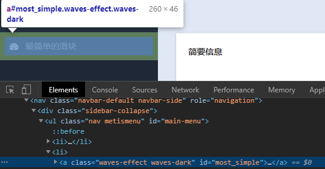
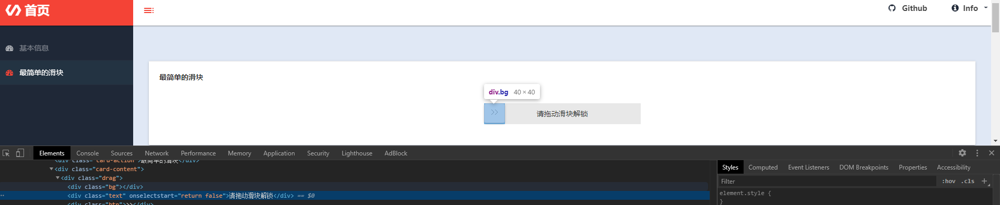

## 基本信息
<!--  -->
  

## 描述  
这是在自行编写的练习项目的一页  
最简单的滑块验证码，没有任何检测，没返回任何数据给服务器，只要你拉过去就通过

## 使用的包/工具/技术
|步骤|包/工具/技术|
|--|--|
|网页分析|Devtools|
|模拟操作|Selenium|

## 问题与对应处理  
如何拖动滑块

## 分析
### 获取Selenium webdriver  
Selenium 是一个借助浏览器引擎来渲染页面的工具  
想要渲染页面，就需要自己配置一个webdriver  
在设置好以后，用get函数获取页面即可开始渲染   
这里我用自己预设的已经设置好的Chrome webdriver来启动，并用get函数打开网页  
```python
chrome_driver = get_selenium_chrome_web_driver()
chrome_driver.get('http://127.0.0.1:5000/LearningSpider#!')
```


### 开始在首页  
<!--    -->
  
由于一开始是在首页，要进入滑块页面需要点击一下按钮  
<!--    -->
  

```python
wait = WebDriverWait(chrome_driver, 10)  # 设置让浏览器等待10s
try:
    simple_slide_code_button = wait.until(
        EC.element_to_be_clickable((By.ID, "most_simple")))  # 根据ID，等待菜单元素出现
except TimeoutException as e:
    print(e)
    exit(1)
simple_slide_code_button.click()  # 点击
```

### 验证码页  
<!--    -->
  
#### 捕获元素，计算坐标
捕获到 滑块元素 和 滑动条元素，计算需要起始坐标和终点坐标  

```python
def count_start_end_location(button_size, button_location, bar_size, bar_location):
    '''
    计算起始点和终点坐标
    '''
    return [
        {'x': button_location['x']+button_size['width']/2, 'y': button_location['y']+button_size['height']/2},
        {'x': bar_location['x']+bar_size['width']-button_size['width']/2, 'y': bar_location['y']}]

ver_button = wait.until(
    EC.element_to_be_clickable((By.XPATH, "//*[@id=\"page-inner\"]/div[1]/div/div/div[2]/div[1]/div[3]")))
slide_bar = wait.until(
    EC.presence_of_element_located((By.XPATH, "//*[@id=\"page-inner\"]/div[1]/div/div/div[2]/div[1]/div[2]")))
# 使用size函数获取元素 宽,高， 
# 使用location函数获取元素相对于整个网页的位置
start_location, end_location = count_start_end_location(ver_button.size, ver_button.location, slide_bar.size, slide_bar.location)
```
虽然实际上并不需要y轴的坐标，因为这只是个向右拉就可以的滑块。但这里还是计算了y  

#### 计算距离，模拟鼠标  
```python
def get_track(start_locationn, end_location):
    '''
    计算偏移
        这里使用最简单的方法来获取偏移数组
        计算好距离以后，让鼠标每次移动2像素 匀速移动
    '''
    distance = int(end_location['x'] - start_locationn['x']) + 1
    return range(0, distance, 2)

def move_mouse(chrome_driver, ver_button, track):
    # 移动鼠标
    try:
        # 让鼠标点击并不放开滑块
        ActionChains(chrome_driver).click_and_hold(ver_button).perform()
        for x in track:
            # 让鼠标根据偏移数组，一点一点的移动鼠标
            ActionChains(chrome_driver).move_by_offset(xoffset=x, yoffset=0).perform()
        # 释放鼠标
        ActionChains(chrome_driver).release().perform()
    except Exception:
        ActionChains(chrome_driver).release().perform()

track = get_track(start_location, end_location)
move_mouse(chrome_driver, ver_button, track)
```
中途可能会发生一些事件，页面上的变动可能会导致鼠标动作报错  

### 最终效果
<!--    -->
  


>对于这种没有检测的拖动行为的验证码，匀速移动是可以通过的  
但对于那些大网站在使用的滑块验证，普遍都有行为检测  
即，如果你拖滑块拖的不像人（比如上面的匀速直线运动），验证码不会让你通过  
要骗过检测，就像个人那样(变速拖动，手抖之类的)就好了  

<p style="text-align:right">Recluse<br>2020-8-1 21:55:46</p>