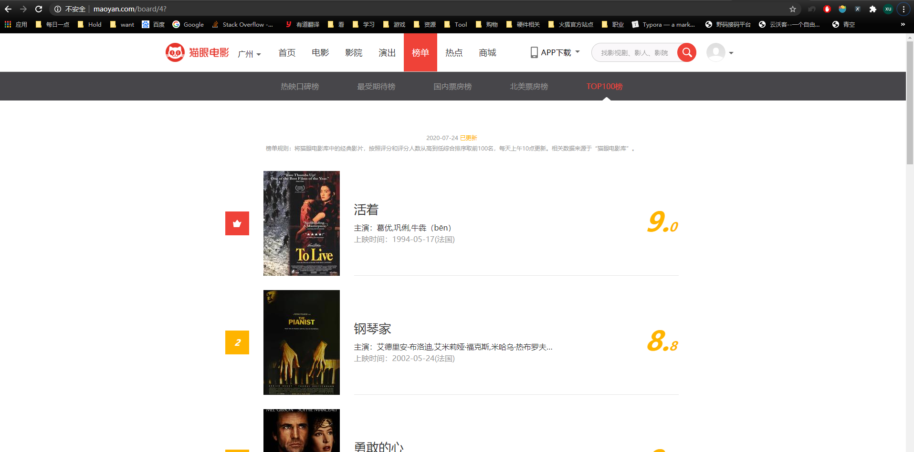

## 基本信息
目标URL：https://maoyan.com/board/4  
<!--    -->
  

前100的电影的信息爬下来，保存起来

## 描述  
静态网页，非常简单  

## 使用的包/工具/技术
|步骤|包/工具/技术|
|--|--|
|网页分析|Chrome|
|爬取网页|requests|
|解析网页|re|

## 问题与对应处理  
### IP访问频率  
懒得弄代理，选择每次爬取后等待一段时间   
### User-Agent限制  
请求头对应项填写一下即可  

## 分析  

### 翻页参数  
<!--    -->
  
<!--    -->
  
翻页的参数每一次加10而不是1  

Recluse 2020-7-23 23:12:00 
