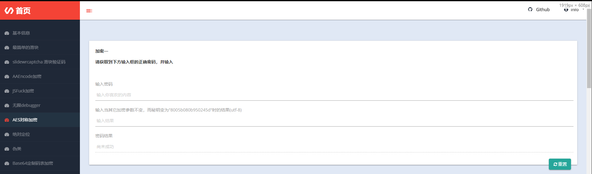
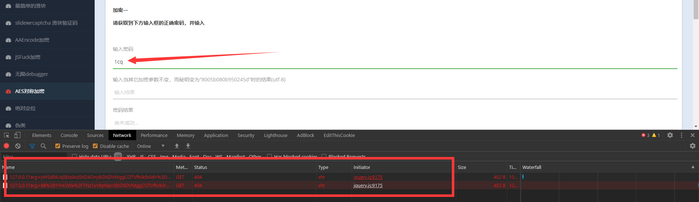
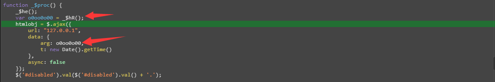
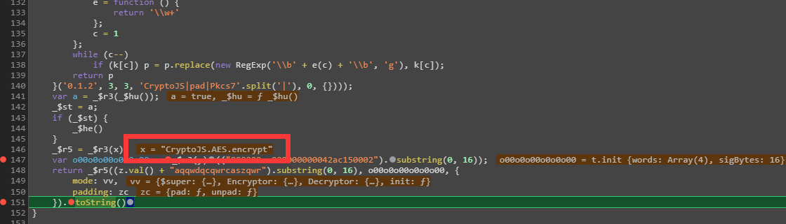

## 基本信息
这是来自这个项目web部分的一个内容  
<!--    -->
  

## 描述  
静态网页

## 使用的包/工具/技术
|步骤|包/工具/技术|
|--|--|
|网页分析|Devtools|

## 问题与对应处理  
### AES对称加密  
密文，秘钥，填充模式。缺一不可得明文  

## 分析  
打开调试工具里面跳出一个无限debugger  
<!--    -->
  
根据堆栈，观察函数，决定注入代码清除`_$he函数`  
~~~javascript
_$he = function(){}
~~~
退出调试工具再进入，`无限debugger`解除了  

<!--  -->
  
往输入框里随便输入一些密码会跳出来一个debugger，不是循环....忍了，懒得处理  
>想要处理的话可以利用reres或者Fiddler来处理

根据包，找到发送请求的js代码  
<!--    -->
  
发现参数由`_$hR函数`运行得来，于是追踪函数的返回值  
打个断点，然后判断内容  
<!--    -->
  

>对AES不熟悉的话可以看看我的笔记
>https://evilrecluse.top/2020/08/19/%E7%BC%96%E7%A0%81%E5%92%8C%E5%8A%A0%E5%AF%86-js-python/  

得知是AES，那么就开始好办了  
AES关键是需要知道三要素：密文，秘钥，填充模式  

打个断点逐一追寻变量来源即可获知所有的需求  
然后根据题目要求填写答案即可完成  

### 最终代码参考  
在追寻变量过程中多记录内容  
~~~javascript
_$vD = window;
var o0oo0o00 = "";
(function() {
    setInterval(function() {
        _$he()
    }, 4000)
}());
function _$fI() {
    debugger
}

function _$he() {
    var a = new Date();
    _$fI();
    _$jD = (new Date() - a > 100);
    if (_$jD) {
        _$hR()
    }
}

z = $("#the_words");
kk = $("#eny_words");

function _$hR() {
    var x = eval(function (p, a, c, k, e, r) {
        e = function (c) {
            return c.toString(a)
        };
        if (!''.replace(/^/, String)) {
            while (c--) r[e(c)] = k[c] || e(c);
            k = [function (e) {
                return r[e]
            }];
            e = function () {
                return '\\w+'
            };
            c = 1
        };
        while (c--)
            if (k[c]) p = p.replace(new RegExp('\\b' + e(c) + '\\b', 'g'), k[c]);
        return p
    }('\'\\6\\0\\1\\2\\3\\7\\8\\4\\5\\9\\a\\4\\5\\b\\c\\d\\0\\1\\2\\3\'', 14, 14,
        'x72|x79|x70|x74|x53|x2e|x43|x6f|x4a|x41|x45|x65|x6e|x63'.split('|'), 0, {}));
    y = eval(function (p, a, c, k, e, r) {
        e = function (c) {
            return c.toString(a)
        };
        if (!''.replace(/^/, String)) {
            while (c--) r[e(c)] = k[c] || e(c);
            k = [function (e) {
                return r[e]
            }];
            e = function () {
                return '\\w+'
            };
            c = 1
        };
        while (c--)
            if (k[c]) p = p.replace(new RegExp('\\b' + e(c) + '\\b', 'g'), k[c]);
        return p
    }('"\\5\\1\\6\\2\\3\\7\\8\\9\\0\\4\\a\\b\\0\\c\\3\\d\\e\\0\\2\\f\\1\\g\\4"', 17, 17,
        'x2e|x72|x70|x74|x65|x43|x79|x6f|x4a|x53|x6e|x63|x55|x66|x38|x61|x73'.split('|'), 0, {}));

    function _$jG() { // 实际上只是个返回"eval"的函数
        var o0000o = "";
        var o00o0o = [101, 119, 99, 111];
        for (var i = 0; i < o00o0o.length; i++) {
            var o00o00 = o00o0o[i] - i;
            o0000o += String.fromCharCode(o00o00);
        }
        return o0000o;
    }

    function _$hu() {
        return "(function() {var a = new Date(); debugger; return new Date() - a > 100;}())"
    }

    function _$jG() {
        var o0000o = "";
        var o00o0o = [101, 119, 99, 111];
        for (var i = 0; i < o00o0o.length; i++) {
            var o00o00 = o00o0o[i] - i;
            o0000o += String.fromCharCode(o00o00);
        }
        return o0000o;
    }

    function _$jj() { // 实际上只是个返回"JSON.string"的函数
        var o0000o = "";
        var o00o0o = [74, 82, 77, 75, 42, 110, 110, 107, 97, 101, 93];
        for (var i = 0; i < o00o0o.length; i++) {
            var o00o00 = o00o0o[i] + i;
            o0000o += String.fromCharCode(o00o00);
        }
        return o0000o;
    }
    _$r3 = _$vD[_$jG()]; // 从window中获取到eval函数
    if ((_$r3 + "").indexOf("native") == -1) { // 如果eval函数被改写，那么直接无限debugger
        while (1) {
            _$fI()
        }
    }
    var vv = _$r3(_$r3(function (p, a, c, k, e, r) {
        e = function (c) {
            return c.toString(a)
        };
        if (!''.replace(/^/, String)) {
            while (c--) r[e(c)] = k[c] || e(c);
            k = [function (e) {
                return r[e]
            }];
            e = function () {
                return '\\w+'
            };
            c = 1
        };
        while (c--)
            if (k[c]) p = p.replace(new RegExp('\\b' + e(c) + '\\b', 'g'), k[c]);
        return p
    }('"\\0\\3\\4\\5\\6\\1\\7\\8\\2\\9\\1\\a\\b\\2\\c\\0\\d"', 14, 14,
        'x43|x6f|x2e|x72|x79|x70|x74|x4a|x53|x6d|x64|x65|x45|x42'.split('|'), 0, {})));
    _$r4 = _$r3(_$jj() + "ify"); // 实际上是eval("JSON.stringify")
    if ((_$r4 + "").indexOf("native") == -1) { // 如果JSON.stringify函数被改写，那么直接无限debugger
        while (1) {
            _$fI()
        }
    }
    var zc = _$r3(_$r3(function (p, a, c, k, e, r) {
        e = String;
        if (!''.replace(/^/, String)) {
            while (c--) r[c] = k[c] || c;
            k = [function (e) {
                return r[e]
            }];
            e = function () {
                return '\\w+'
            };
            c = 1
        };
        while (c--)
            if (k[c]) p = p.replace(new RegExp('\\b' + e(c) + '\\b', 'g'), k[c]);
        return p
    }('0.1.2', 3, 3, 'CryptoJS|pad|Pkcs7'.split('|'), 0, {})));
    var a = _$r3(_$hu()); // 实际上是在eval一个会进行无限debugger的字符串
    _$st = a;
    if (_$st) {
        _$he();
    }

    _$r5 = _$r3(x);

    var o00o0o00o0o0o00 = _$r3(y)( // 转码切分
        ("000000zc000000000042ac150002").substring(0, 16) // 实际上是"e44834e4328438e2"
    );

    return _$r5(
        (z.val() + "aqqwdqcqwrcaszqwr").substring(0, 16),
        o00o0o00o0o0o00, // 秘钥 实际上是"e44834e4328438e2"
        {
            mode: vv, // AES模式  实际是ECB
            padding: zc // AES填充方式  实际是Pkcs7
        }).toString();
}

function _$proc() {
    _$he();
    var o0oo0o00 = _$hR();
    htmlobj = $.ajax({
        url: "127.0.0.1",
        data: {
            arg: o0oo0o00,
            t: new Date().getTime()
        },
        async: false
    });

    $('#disabled').val($('#disabled').val() + '.');

    // 下面是答案检查的代码，如果你希望锻炼你的能力，请不要在得到正确结果前碰这个代码  
    ['sojson.v4']["\x66\x69\x6c\x74\x65\x72"]["\x63\x6f\x6e\x73\x74\x72\x75\x63\x74\x6f\x72"](((['sojson.v4'] + [])["\x63\x6f\x6e\x73\x74\x72\x75\x63\x74\x6f\x72"]['\x66\x72\x6f\x6d\x43\x68\x61\x72\x43\x6f\x64\x65']['\x61\x70\x70\x6c\x79'](null, "118A97L114I32q97C32v61x32W67n114N121L112A116X111g74X83Y46L65E69f83X46O101D110U99y114r121W112W116O40e10A32G32W32m32G32l32D32e32T40O122e46F118D97z108t40Q41Q32O43w32W34F97d113b113d119j100t113k99W113z119E114h99f97e115I122s113j119H114S34Z41J46E115G117Z98G115O116t114k105n110Z103W40g48t44v32L49r54q41J44A32v47a47o32f116a101d120Y116b10V32L32H32W32U32d32c32P32w67j114c121O112k116m111Y74f83v46D101U110h99E46q85r116c102P56u46I112x97w114r115f101I40g34C56u48z48d53T98J48X56p48V98M57L53B48F50K52Y53k100y34v41r44k32x47G47y32E107B101z121k10G32R32p32P32Z32F32I32r32G123M10O32E32n32p32c32A32q32P32C32x32m32s32J109U111J100B101a58A32W67o114P121X112H116H111j74q83m46b109U111I100o101t46t69a67Y66S44e10D32D32k32i32e32g32Y32v32h32S32d32S32T112r97E100n100l105o110J103b58y32b67z114V121E112U116I111j74I83j46v112h97Z100W46V80P107w99a115C55S10D32Q32B32h32r32g32t32q32l125y41C46w116q111l83v116O114e105v110y103z40c41A59c10k32i32u32F32b105B102z32w40q107w107Z46q118y97F108S40M41u32B61b61E61H32i97z41T32f123L10B32k32S32p32j32F32t32D32z36L40v39r35O100g105d115D97a98n108A101L100z39g41Q46E118k97I108R40w34T25104W21151k34w41G59U10U32F32L32M32r125" ['\x73\x70\x6c\x69\x74'](/[a-zA-Z]{1,}/))))('sojson.v4');
}

z.bind("input propertychange", function () {
    _$proc()
});
kk.bind("input propertychange", function () {
    _$proc()
});

// 为重置按钮绑定事件
$("#reset_inner").click(function () {
    $('#disabled').val("尚未成功");
});
~~~

Recluse 2020年8月28日01:36:32 
