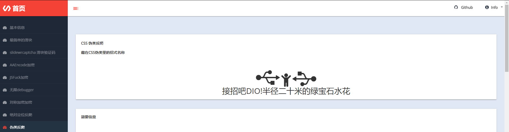
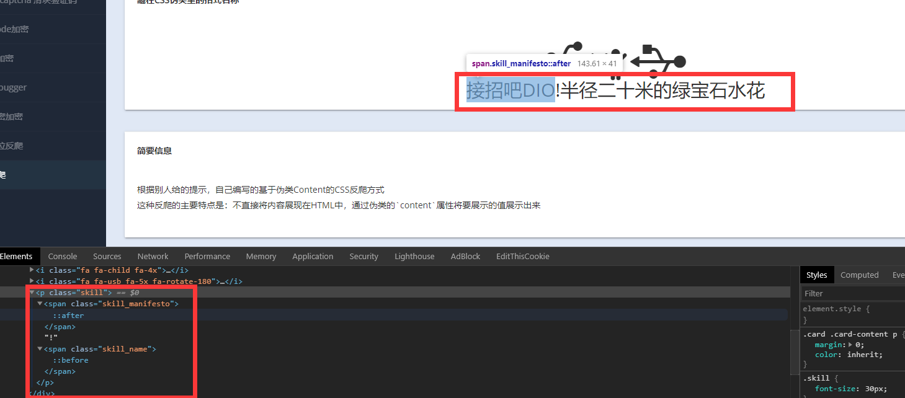

## 基本信息
来自于这个项目web部分的一个爬虫练习  
<!--    -->
  

## 使用的包/工具/技术
|步骤|包/工具/技术|
|--|--|
|网页分析|Devtools|
|数据爬取|requests|
|解析网页|json|

## 问题与对应处理  
### CSS反爬 - 伪类  
将网页的一部分数据内容存放到CSS伪类的Content属性中，以达到捕获的html中缺失数据的目的  

## 分析  
网页看上去非常的正常的，先打开元素面板查看情况  
<!--  -->
  
发现，实际上html中根本没有目标数据  

这是因为这些数据是通过CSS伪类content来贴上去的  
  
挖空一些数据，然后在CSS伪类content里将数据填上就能达到效果  

## 解决  
找到CSS伪类样式以后，将content内容抓出，与原文合并即可  
代码见`spider.py`

Recluse 2020年8月26日22:06:22
