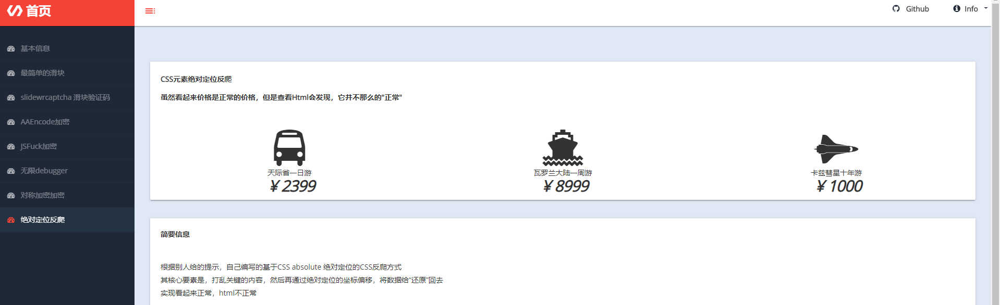
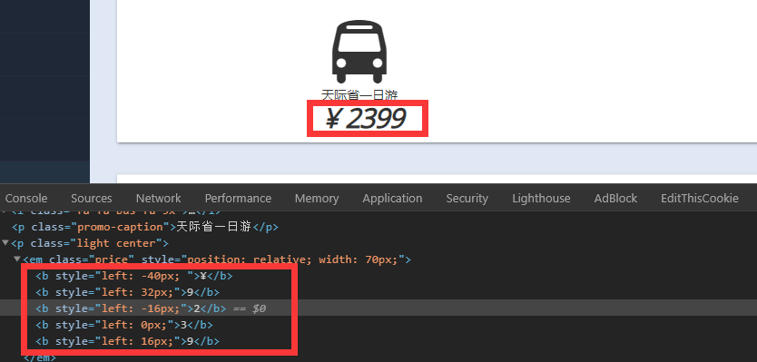
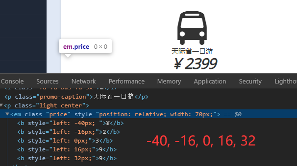

## 基本信息
来自于这个项目web部分的一个爬虫练习  
<!--    -->
  

## 使用的包/工具/技术
|步骤|包/工具/技术|
|--|--|
|网页分析|Devtools|

## 问题与对应处理  
### CSS反爬 - 元素绝对定位  
先打乱关键内容顺序，然后通过绝对定位将内容弄得看起来很正常  

## 分析  
网页看上去非常的正常的，先打开元素面板查看情况  
<!--  -->
  
发现，实际上数字顺序并不一样  

这是由于元素是通过绝对定位的方式重新定位了位置所导致的  

>CSS绝对定位  
绝对定位使元素的位置与文档流无关，不占据空间  
绝对定位的元素的位置相对于最近的已定位祖先元素，如果元素没有已定位的祖先元素，那么它的位置相对于最初的包含块  

在这里，任何一个价格的偏移量数字都是相对于左边而言的  
那么根据偏移量从小到大重新排序，就能得到和感官上一致的结果  
<!--  -->
  

## 解决  
定位到目标元素，获取对应偏移量，结合实际文本排序后得到正确结果  
代码见`spider.py`

Recluse 2020年8月25日23:41:26
