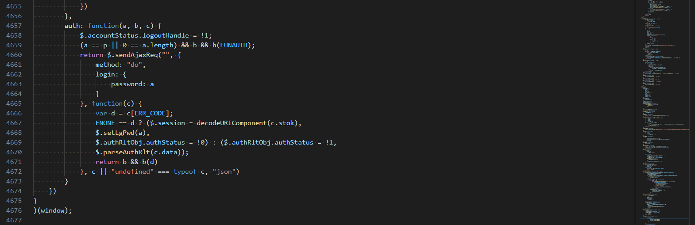
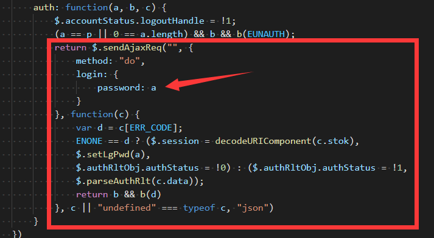
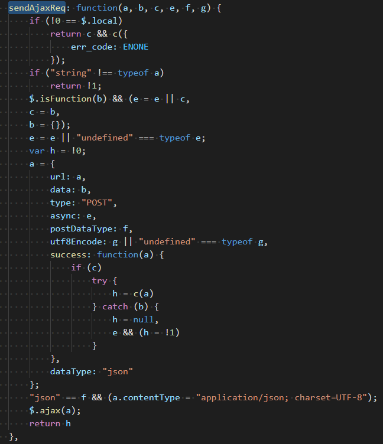
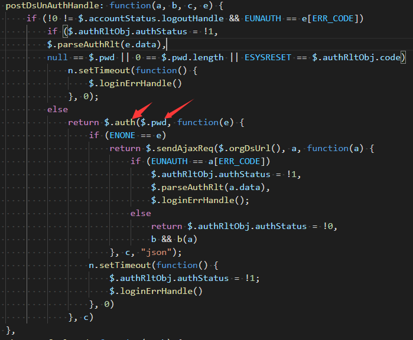
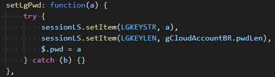
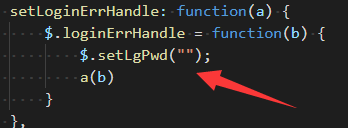
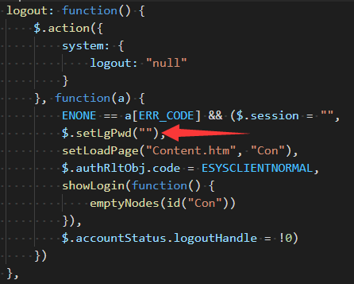
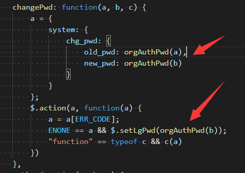
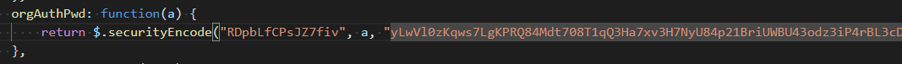
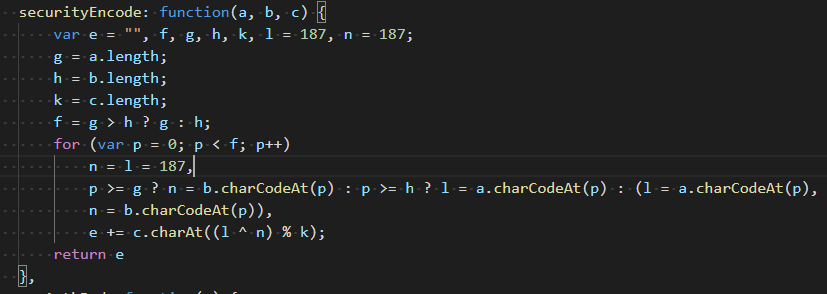

## 基本信息  
有人想要知道他家里路由器密码的加密方式，出价50块，给了一个js文件  
让我在这份js文件里寻找加密函数  

## 描述  
只有一份孤立的js文件，很多东西都缺失了，只能慢慢分析寻找加密函数了  
他自己找到了请求函数，但说花了一个下午找不到加密函数在哪里  

## 使用的包/工具/技术  
|步骤|包/工具/技术|
|--|--|
|代码分析|VSCode|


## 分析  
### js文件信息  

* 没有任何混淆，所有内容都是常规内容  
* 一共4677行，所有url或者ip信息都被删掉了  
* 所给的已知的请求函数  
<!--    -->
  
其实这里有一个很奇怪的点，他说他不会js，但这个函数并不是Ajax发送请求的函数，但他却找到了这个函数  

### 思路  
观察到这个函数实际上不是发送Ajax请求的函数，但看上去应该是调用Ajax发送请求的函数  
需要寻找到发送Ajax请求的函数，将密码数据所在给标记上来  
不断观察调用关系，搜索关键词，最终找到加密函数  

### 追寻Ajax发送函数  
<!--    -->

尽管已经被告知这个函数就是入口，函数第一个参数a就是已经被加密的密码  
但是担心会出什么问题，还是去寻找了发送Ajax的函数  

<!--    -->
  
观察到，第二个参数b（即被加密的密码dict），并没有被做出什么特别处理就发送以后，安定了下来  

### 追寻加密函数  
知道auth函数第一个参数就是被加密的密码，于是开始根据函数名进行搜索  
<!--    -->
  
找到一处调用auth函数的结果，其中第一个参数传入的是pwd这个变量  

于是搜索pwd这个变量的赋值语句  
<!--    -->
  
只找到setLgPwd函数对pwd进行了赋值  
唯一一个参数会作为密码给pwd

继续搜索，寻找调用setLgPwd的函数  
寻找到了三个结果
* 结果1  
<!--    -->
  
传入的参数为""，显然不是目标
* 结果2  
<!--    -->
  
传入参数依然为""，显然不是目标
* 结果3  
<!--    -->
  
可以观察到，传入的参数都是进行通过orgAuthPwd函数以后的内容  

寻找orgAuthPwd函数  
<!--    -->

感觉似乎非常接近目标了  

寻找securityEncode函数  
<!--    -->

三个参数，两个为orgAuthPwd函数里写好的字符串，一个为密码  

至此问题解决  

## 思路截取js  
当初我就是将这份js发给他的，然后告诉到关键函数是 orgAuthPwd  
然后把下面这份 思路记录js 发给它，谁知道他最后告诉我，他花了100块找其他人解决了  
原因是他不懂js......（我感觉就是骗白嫖，你不懂，怎么知道入口函数在哪里）  
```javascript
c.extend({
    //----------------------------------------------------------------------------------5
    // 至此游戏结束参数均可获得
    securityEncode: function (a, b, c) {
        var e = "",
            f, g, h, k, l = 187,
            n = 187;
        g = a.length;
        h = b.length;
        k = c.length;
        f = g > h ? g : h;
        for (var p = 0; p < f; p++)
            n = l = 187,
            p >= g ? n = b.charCodeAt(p) : p >= h ? l = a.charCodeAt(p) : (l = a.charCodeAt(p),
                n = b.charCodeAt(p)),
            e += c.charAt((l ^ n) % k);
        return e
    },
    //----------------------------------------------------------------------------------5
    // 追寻到，此函数引用 securityEncode 函数
    orgAuthPwd: function (a) {
        return $.securityEncode("RDpbLfCPsJZ7fiv", a, "yLwVl0zKqws7LgKPRQ84Mdt708T1qQ3Ha7xv3H7NyU84p21BriUWBU43odz3iP4rBL3cD02KZciXTysVXiV8ngg6vL48rPJyAUw0HurW20xqxv9aYb4M9wK1Ae0wlro510qXeU07kV57fQMc8L6aLgMLwygtc0F10a0Dg70TOoouyFhdysuRMO51yY5ZlOZZLEal1h0t9YQW0Ko7oBwmCAHoic4HYbUyVeU3sfQ1xtXcPcf1aT303wAQhv66qzW")
    },
    //----------------------------------------------------------------------------------4
    // 以下为 setLgPwd 引用，认证函数auth也会引用
    // 追寻到，给密码赋值前需要通过 orgAuthPwd 函数

    // 赋一个空，显然不是目标
    setLoginErrHandle: function (a) {
        $.loginErrHandle = function (b) {
            //-------!-------
            $.setLgPwd("");
            //---------------
            a(b)
        }
    },
    // 赋一个空，显然不是目标
    logout: function () {
        $.action({
            system: {
                logout: "null"
            }
        }, function (a) {
            ENONE == a[ERR_CODE] && ($.session = "",
                //-------!-------
                $.setLgPwd(""),
                //---------------
                setLoadPage("Content.htm", "Con"),
                $.authRltObj.code = ESYSCLIENTNORMAL,
                showLogin(function () {
                    emptyNodes(id("Con"))
                }),
                $.accountStatus.logoutHandle = !0)
        })
    },
    // 键名为修改默认密码
    changeDefaultPwd: function (a, b) {
        //--------!----------
        var c = orgAuthPwd(a),
            e = {
                method: "do",
                set_password: {
                    password: c
                }
            };
        //-------------------
        $.accountStatus.logoutHandle = !1;
        $.sendAjaxReq("", e, function (a) {
            var e = a[ERR_CODE];
            ENONE == e && ($.authRltObj.authStatus = !0,
                //--------!----------
                $.setLgPwd(c),
                //-------------------
                $.session = decodeURIComponent(a.stok));
            b && b(e)
        }, !0, "json")
    },
    // 键名为修改密码
    changePwd: function (a, b, c) {
        a = {
            system: {
                chg_pwd: {
                    old_pwd: orgAuthPwd(a),
                    new_pwd: orgAuthPwd(b)
                }
            }
        };
        $.action(a, function (a) {
            a = a[ERR_CODE];
            //--------------------!----------------------
            ENONE == a && $.setLgPwd(orgAuthPwd(b));
            //-------------------------------------------
            "function" == typeof c && c(a)
        })
    },

    //----------------------------------------------------------------------------------3
    // js中仅此一处赋值$.pwd
    // 参数1 为所求
    // 键值似乎是 设置密码
    setLgPwd: function (a) {
        try {
            sessionLS.setItem(LGKEYSTR, a),
                sessionLS.setItem(LGKEYLEN, gCloudAccountBR.pwdLen),
                //----!----
                $.pwd = a
                //--------
        } catch (b) {}
    },

    //----------------------------------------------------------------------------------2
    // $.pwd为所求
    postDsUnAuthHandle: function (a, b, c, e) {
        if (!0 != $.accountStatus.logoutHandle && EUNAUTH == e[ERR_CODE])
            if ($.authRltObj.authStatus = !1,
                $.parseAuthRlt(e.data),
                null == $.pwd || 0 == $.pwd.length || ESYSRESET == $.authRltObj.code)
                n.setTimeout(function () {
                    $.loginErrHandle()
                }, 0);
            else
                return $.auth(
                    //----!-----
                    $.pwd,
                    //----------
                    function (e) {
                        if (ENONE == e)
                            return $.sendAjaxReq($.orgDsUrl(), a, function (a) {
                                if (EUNAUTH == a[ERR_CODE])
                                    $.authRltObj.authStatus = !1,
                                    $.parseAuthRlt(a.data),
                                    $.loginErrHandle();
                                else
                                    return $.authRltObj.authStatus = !0,
                                        b && b(a)
                            }, c, "json");
                        n.setTimeout(function () {
                            $.authRltObj.authStatus = !1;
                            $.loginErrHandle()
                        }, 0)
                    },
                    c
                )
    },
    //----------------------------------------------------------------------------------1
    // 认证函数
    // 参数1 为所求数据
    auth: function (a, b, c) {
        $.accountStatus.logoutHandle = !1;
        (a == p || 0 == a.length) && b && b(EUNAUTH);
        return $.sendAjaxReq(
            "",
            //-----!-------
            {
                method: "do",
                login: {
                    password: a
                }
            },
            //-------------
            function (c) {
                var d = c[ERR_CODE];
                ENONE == d ? ($.session = decodeURIComponent(c.stok), $.setLgPwd(a), $.authRltObj.authStatus = !0) : ($.authRltObj.authStatus = !1, $.parseAuthRlt(c.data));
                return b && b(d)
            },
            c || "undefined" === typeof c,
            "json")
    },

    //-----------------------------------------------------------------------------------0
    //  发送Ajax请求
    //  参数2 为所求数据
    sendAjaxReq: function (a, b, c, e, f, g) {
        if (!0 == $.local)
            return c && c({
                err_code: ENONE
            });
        if ("string" !== typeof a)
            return !1;
        "function" === c.type(b) && (e = e || c,
            c = b,
            b = {});
        e = e || "undefined" === typeof e;
        var h = !0;
        a = {
            url: a,
            //----!-----
            data: b,
            //----------
            type: "POST",
            async: e,
            postDataType: f,
            utf8Encode: g || "undefined" === typeof g,
            success: function (a) {
                if (c)
                    try {
                        h = c(a)
                    } catch (b) {
                        h = null,
                            e && (h = !1)
                    }
            },
            dataType: "json"
        };
        "json" == f && (a.contentType = "application/json; charset=UTF-8");
        $.ajax(a);
        return h
    },
})
```


<p style="text-align:right">Recluse<br>2020年8月9日15:50:17 </p>