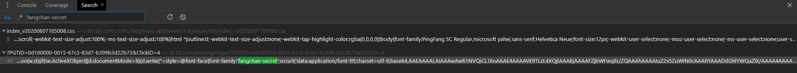
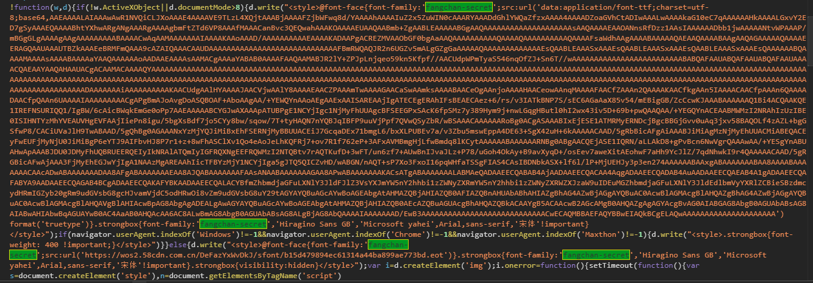
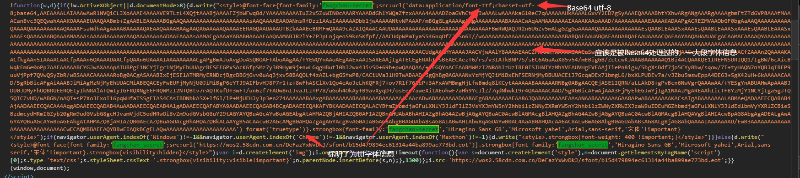
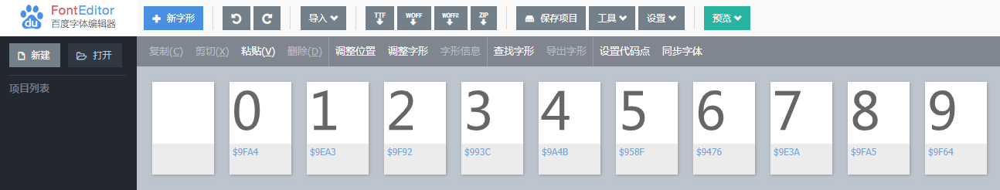

## 基本信息
目标URL：https://zz.58.com/pinpaigongyu/?PGTID=0d100000-0015-67c3-83d7-b399b3d22b73&ClickID=4  
<!--  -->
  

## 描述  
静态网页（如果你不刷更多内容，它会是静态）  
58同城的品牌公寓信息
对CSS字体加密问题的一次尝试，并非大规模抓取  

## 使用的包/工具/技术
| 步骤       | 包/工具/技术 |
| ---------- | ------------ |
| 网页分析   | Devtools     |
| 爬取网页   | requests     |
| 解析网页   | re  xpath    |
| 数据持久化 | json         |

## 问题与对应处理  
* 字体反爬  
自定义字体，改变`unicode字符`映射关系，使得一些内容无法正常解析  

## 分析  
### 字体反爬思路整理
#### `&#x`  
`&#x`是一个特殊的前缀，这是经过浏览器转义过后的`Unicode`字符标识符，作用就和python里的`\u`差不多  
它会让浏览器识别出这整个东西（直到后面的`;`为止）是用来表示一个`unicode字符`的  
浏览器识别出来后，会自动将其转化为对应的`Unicode字符`  
在默认的情况下，浏览器会使用默认的`Unicode码表`，但如果人人都使用默认码表，那么就不存在加密的可能性了  

#### 字体反爬思路  
字体反爬设计者 会通过自定义一个字体，更变字符映射关系  
将一些原本指向非常少用的`Unicode字符`的`字符码`指向其 自定义的字符(数字字母之列的)  
如果爬虫者不处理其自定义的`Unicode字符关系`，那么通过爬虫得到的网页会是用标准`Unicode`码表处理以后得到的结果（即，一个非常少用的`Unicode字符`），从而得不到正确信息

#### 反反爬思路
需要做的是: 找出正确的`Unicode码`与`Unicode字符`关系，用正确的字符取代网页上的`Unicode码`  

### 过程  
网页整体爬取并没有什么大问题，设置一个比较合理的头部即可获取  
唯一需要解决的就是字体的问题  
<!--  -->
  
<!--    -->
  

#### 寻字体定义  
首先从找寻字体定义开始  
<!--    -->
  

留意到绑定了很多种字体  
* `fangchan-secret`  
其自定义的字体，也是接下来要处理的字体  
* `Hiragino Sans GB`  
冬青黑体简体中文。能够在网上找到字体本体的字体，并非自定  
* `Microsoft yahei`  
微软雅黑。能够在系统中找到字体本体的字体，并非自定  
* `Arial`  
Arial字体。能够在网上找到字体本体的字体，并非自定  
* `sans-serif`  
一种经常使用的西文字体。能够在网上找到字体本体的字体，并非自定  
* `"\5B8B\4F53"!important`  
  * \5B8B\4F53宋体。没错，是宋体，因为直接在CSS中写中文"宋体"来定义的话，可能会出现编码问题，所以使用这种方式来定义  
  * !important，作用是提高指定样式规则的应用优先权（优先级）

全局搜索`fangchan-secret`
<!--    -->
  
最终，在html中找到定义  
<!--    -->
  

#### 字体信息获取  
对定义进行分析  
<!--    -->
  

那么手法还是明显的，这是一段由`Base64`处理`ttf字体信息`得到的结果  
那么现在，为了得到字体文件，我需要将这个结果还原回`ttf字体信息`  

~~~python
def get_font_ttf(html: str):
    '''
    解析字体内容
    '''
    print('正在从html中获取字体信息')
    pattern = re.compile(r"font-family:'fangchan-secret';[\s\S]+?data:application/font-ttf;[\s\S]+?;(.*?),(.*?)'\)")
    font_info_b64 = re.findall(pattern, html)
    print(font_info_b64[0])

    font_info = base64.b64decode(font_info_b64[0][1])
    with open('example/未完成_CSS字体反爬/58_font.ttf', 'wb')as f:
        f.write(font_info)
        print('字体内容解码完毕，已保存ttf文件')
    return font_info
~~~

在保存好`ttf文件`以后，打开`ttf文件`  
查看`记录值`与`实际值`的对应关系  
<!--    -->
  

肉眼观察得到对应项目  
>对于可能会变动的类型，可以通过导出xml，再从xml中导出“笔画”让orc来识别来获取对应项目  

~~~python
{'glyph1': 0, 'glyph2': 1,  'glyph3': 2, 'glyph4': 3, 'glyph5': 4, 'glyph6': 5, 'glyph7': 6, 'glyph8': 7, 'glyph9': 8, 'glyph10': 9}
~~~

在python中获取字体与`Unicode值`与`记录值`关系  
~~~python
font['cmap'].tables[0].ttFont.tables['cmap'].tables[0].cmap

{38006: 'glyph00006', 38287: 'glyph00008', 39228: 'glyph00004', 39499: 'glyph00005', 40506: 'glyph00010', 40611: 'glyph00003', 40804: 'glyph00009', 40850: 'glyph00001', 40868: 'glyph00002', 40869: 'glyph00007'}
~~~

将上面两个字典合并起来,顺便将`Unicode值`进行html转义  
形成 `转换字典`{`Unicode值（html转义）`:`实际值`}  

~~~python
convert_u2val_dict = {}
for _key, _val in convert_u2mid_dict.items():
    _key = '&#x' + str(chr(_key).encode('unicode_escape'))[5:-1] + ';'
    convert_u2val_dict[_key] = font_value_meaning[_val]

{'&#x9476;': 5, '&#x958f;': 7, '&#x993c;': 3, '&#x9a4b;': 4, '&#x9e3a;': 9, '&#x9ea3;': 2, '&#x9f64;': 8, '&#x9f92;': 0, '&#x9fa4;': 
1, '&#x9fa5;': 6}
~~~

利用`转换字典`，将html中的`unicode字符`转为`实际值`  
~~~python
for word, value in convert_u2val_dict.items():
    html_str = html_str.replace(word, str(value))
~~~
如此一来就解决了字体加密的问题了  
余下的就是简单的解析数据  

全部代码见：`spider.py`

Recluse 2020年8月29日12:42:47
