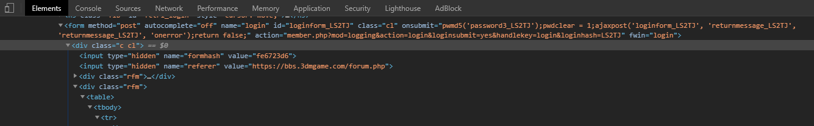
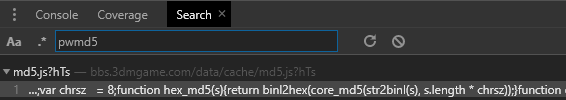
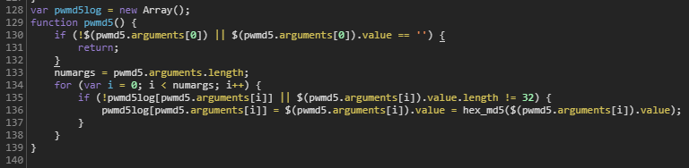
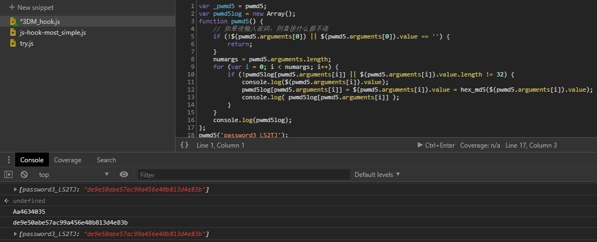
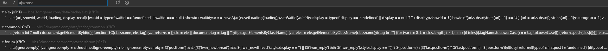
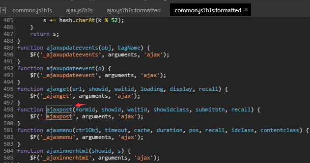
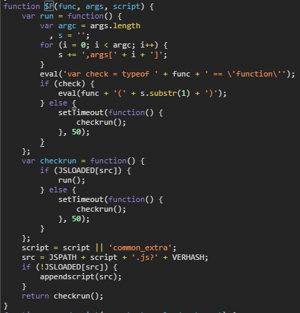
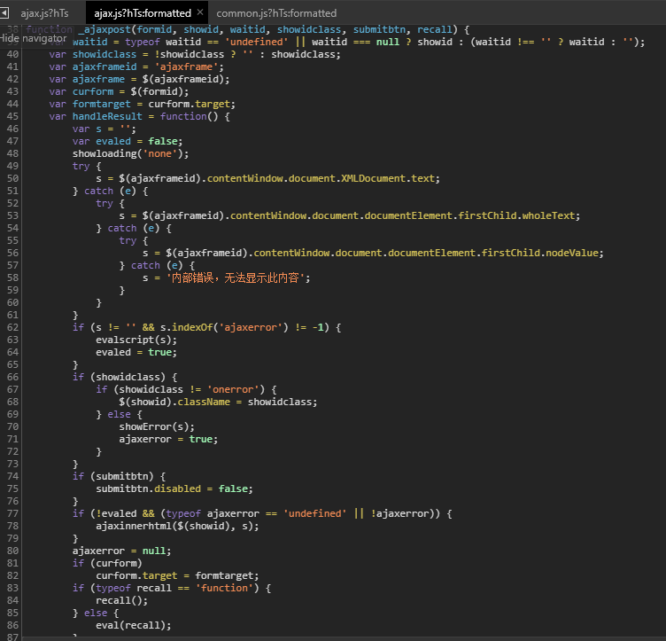

## 基本信息  
目标URL：[https://www.biliob.com/index](https://bbs.3dmgame.com/forum.php)
  

## 描述  
登录的验证码是一个gif图，会不断变动  

## 使用的包/工具/技术  
|步骤|包/工具/技术|
|--|--|
|网页分析|Devtools|
|登录网页|requests|
|打码工具|tesserocr + openCV|

## 问题与对应处理  
### User-Agent限制  
请求头填写自己编写`User-Agent`即可  
### 模拟Ajax请求  
请求头填写自己编写`X-Requested-With`即可  
### GIF验证码  
图片分析，OCR  

## 分析  

### 观察网页本身  
  
把表单内容放在html里，现在算是很少见的形式了  
其他东西都很正常，登录的元素是动态的  

#### `<form onsubmit>` 中的内容  
将HTML中的关键信息记录一下  
`form`中的`onsubmit`内容会在提交的时候执行  
将内容整理出来进行分析  
```javascript
pwmd5('password3_LS2TJ');
pwdclear = 1;
ajaxpost('loginform_LS2TJ', 'returnmessage_LS2TJ', 'returnmessage_LS2TJ', 'onerror');
return false;
```

##### pwmd5('password3_LS2TJ');  
既然是函数，那就找一下定义在哪里  
  
发现只有一个搜索结果  


打开以后规格化，然后找到定义位置  


注入了一下，看了看过程，确实只是将密码栏里的密码作MD5加密而已  
传入的参数是作为寻找密码输入框的线索来用的  

##### pwdclear = 1;  

没有var，那么这个值应该已经被定义，尝试进行搜索后，发现只有在网页中有找到这个变量  
更变这个值, 没有发生什么变化，也就是说，这个变量没有被监听  

##### ajaxpost('loginform_LS2TJ', 'returnmessage_LS2TJ', 'returnmessage_LS2TJ', 'onerror');  
  
全局搜索寻找函数定义，找到三个相关js  

各自细看以后，找到了`ajaxpost`函数定义，定义非常简单粗暴，就是将一些数据丢给`$F`函数  

在同一个文件下，找到了`$F`函数的定义，稍微观察了一下，发现是一个配置调用函数的函数  
三个参数分别是 函数名，传入参数，函数所在的js文件文件名  

于是根据文件名`ajax`找到了`_ajaxpost`函数的定义  



<p style="text-align:right">Recluse<br>2020年7月28日23:46:31 </p>