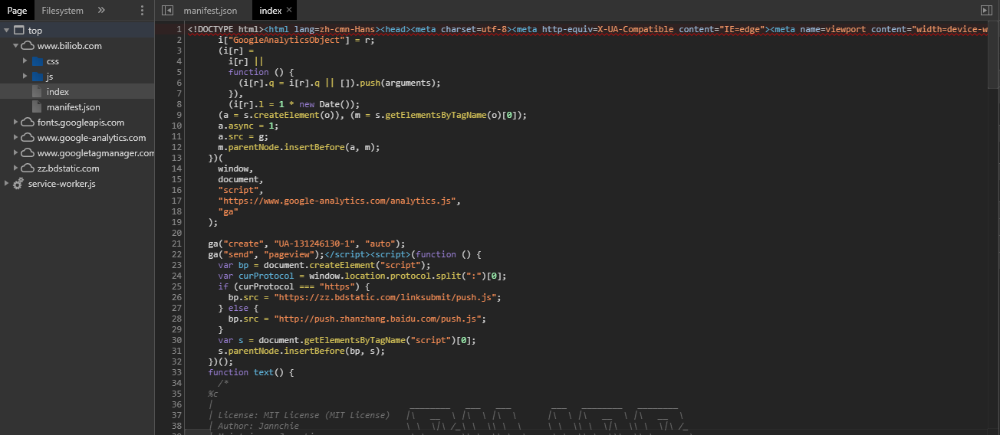

## 基本信息  
目标URL：https://www.biliob.com/index  
  

## 描述  
分析完毕以后发现是动态网页，js没有混淆有逻辑加密  

## 使用的包/工具/技术  
|步骤|包/工具/技术|
|--|--|
|网页分析|Devtools|
|爬取网页|requests|
|解析网页|json|

## 问题与对应处理  
### IP访问频率  
懒得弄代理，选择每次爬取后等待一段时间  
### User-Agent限制  
请求头填写自己编写`User-Agent`即可  
### 模拟Ajax请求  
请求头填写自己编写`X-Requested-With`即可  

## 分析  

### 查看网页源码  
  
网页本身并没有任何的有用信息，是一个动态页面  
不知道用户的搜索目标是啥，给个干净的页面很正常  

### 寻找Ajax目标数据包  
  
发现只有一个数据包  

url: https://www.biliob.com/api/index  
* keyword  
搜索关键词，明文  

### 观察目标数据包  
  
观察到数据包的数据项稀疏只有部分天数的数据，而网页中的数据完整每一天都有指数  
判断存在加密/压缩的情况  

### 被加密/压缩的数据  
根据响应json的关键词`jannchie`进行全局搜索  
  
找到四个结果，一一查看，最终在最后一个js中找到`Axios`的`Ajax`信息  

  
下面有响应的js解析逻辑，然后用python构建一模一样的逻辑，将数据解开  

Recluse 2020-7-23 23:12:00 
